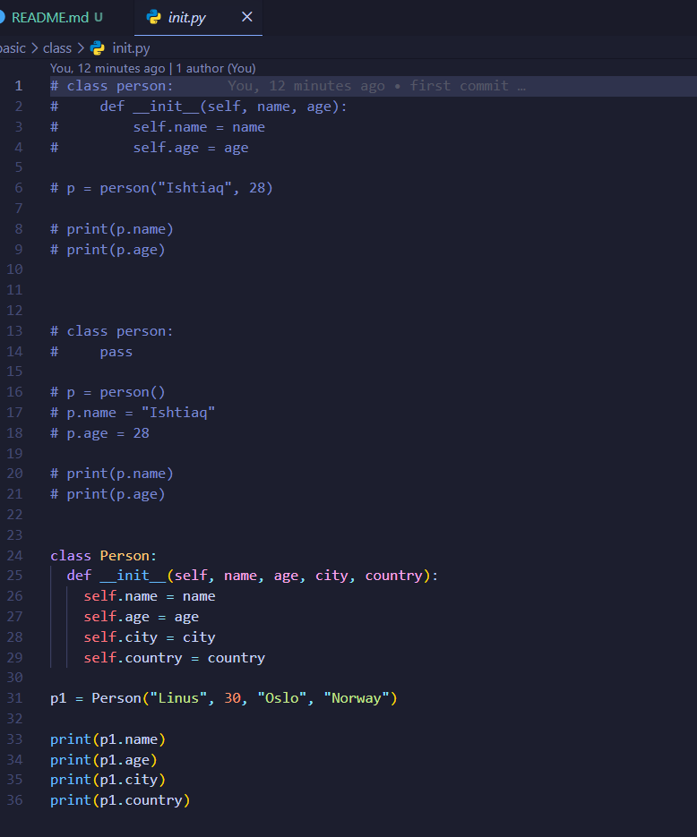
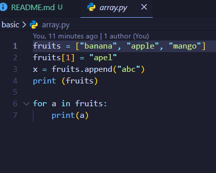
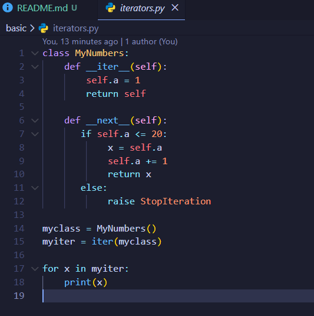

# Python Learning Journey

A complete Python learning repository for beginners.

## Table of Contents

1. Introduction
2. Variables
3. Data Types
4. Strings
5. Operators
6. Conditions
7. Loops
8. Functions
9. Lists
10. Tuples
11. Dictionaries
12. Sets
13. File Handling
14. OOP
15. Tkinter Projects

---

## Variables

Variables are containers for storing data values.

### Example

```python
name = "Ishtiaq"
age = 25

print(name)
print(age)
```

### Output

```
Ishtiaq
25
```

### Practice

Create variables for:
- Your name
- Your age
- Your country

---

## Data Types

Python has several built-in data types.

| Type | Example |
|--------|---------|
| String | "Hello" |
| Integer | 10 |
| Float | 10.5 |
| Boolean | True |
| List | [1,2,3] |
| Tuple | (1,2,3) |
| Dictionary | {"name":"John"} |

### Example

```python
name = "John"
age = 30
height = 5.8
is_student = True
```

---

## Loops

### For Loop

```python
for i in range(5):
    print(i)
```

### While Loop

```python
count = 0

while count < 5:
    print(count)
    count += 1
```

---

## Mini Projects

### Digital Clock

Features:
- Live time update
- 12-hour format
- AM/PM display

### Tic Tac Toe

Features:
- Two-player mode
- Winner detection
- Restart button

### Calculator

Features:
- Addition
- Subtraction
- Multiplication
- Division

---


---

## Author

Ishtiaq Ahmed

GitHub: https://github.com/dev-ishtiaq





